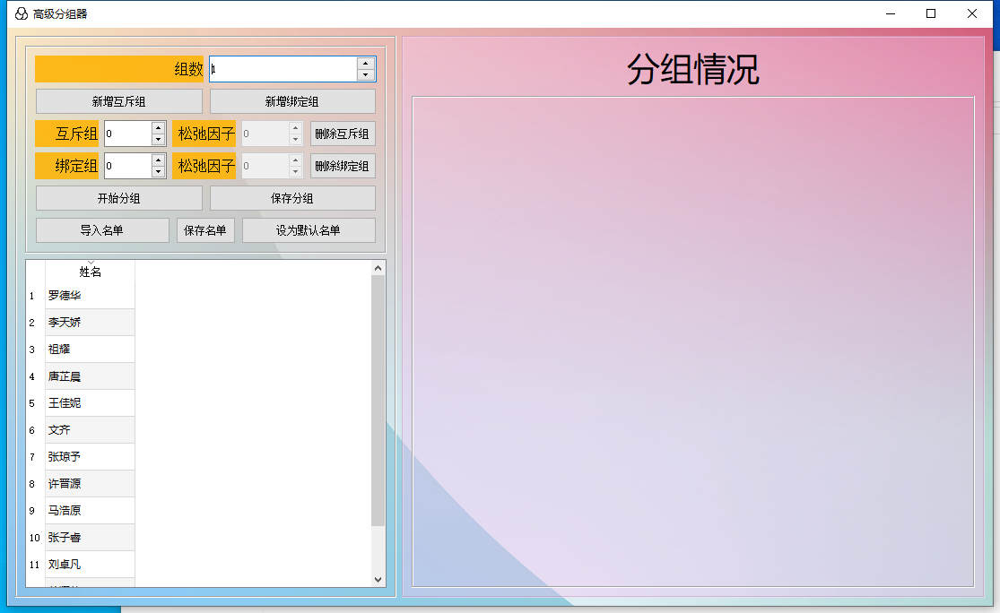

# 简介
这是一个用QT5.12写的分组器。它支持从excel表格中复制名单粘贴到软件内的表格。

可以加入多个互斥条件，在同一互斥条件（软件内称为互斥组）中数字相同的人不会在同一个组。不过引入了松弛因子。互斥松弛因子为1时，严格互斥。松弛因子越大，互斥属性越低，意味着数字相同的人也可能被分到同一个组。

可以加入多个绑定条件。在同一绑定条件中，数字相同的人会在同一个组。不过引入了松弛因子。绑定松弛因子为0时。严格绑定。

